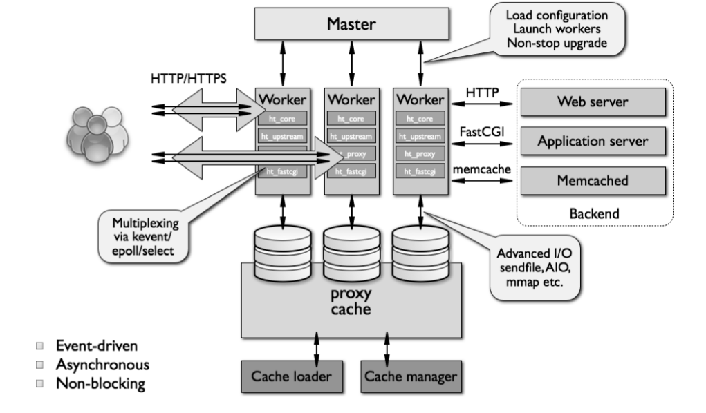
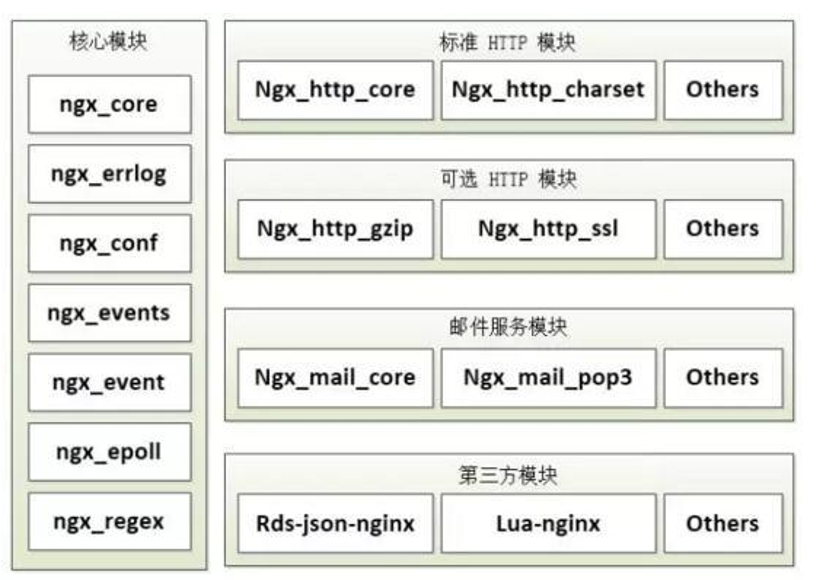

## Nginx 介绍

- `engine X` ，2002 年，开源，商业版 
- NGINX是免费，开源，高性能的HTTP和反向代理服务器，邮件代理服务器，通 用TCP/UDP代理服务器  
- 解决C10K问题（10K Connections） 
- 官网：`http://nginx.org`

- **特性**
    - 模块化设计，较好的扩展性 
    - 高可靠性 
    - 支持热部署：不停机更新配置文件，升级版本，更换日志文件 
    - 低内存消耗：10000个keep-alive连接模式下的非活动连接，仅需2.5M内存 
    - event-driven,aio,mmap，sendfile 

## Nginx 程序架构



- `master`/`worker` 程序架构
    - 一个 `master` 进程：负责加载和分析配置我呢见、管理 `worker` 进程、平滑升级
    - 一个或多个 `worker` 进程：处理并响应用户请求

- 缓存相关的进程：
    - `cache loader`：载入缓存对象
    - `cache manager`：管理缓存对象

## Nginx 模块



nginx高度模块化，但其模块早期不支持DSO机制；`1.9.11` 版本支持动态装载和卸载

- 核心模块：`core module`（Nginx 服务器正常运行 必不可少 的模块，提供 错误日志记录 、 配置文件解析 、 事件驱动机制 、 进程管理 等核心功能 ）
- 标准模块：
    - `HTTP` 模块：`nginx_http_*`（提供 HTTP 协议解析相关的功能，比如： 端口配置 、 网页编 码设置 、 HTTP响应头设置 等等 ）
    - `Mail` 模块：`nginx_mail_*`（主要用于支持 Nginx 的 邮件服务 ，包括对 POP3 协议、 IMAP 协议和 SMTP协议的支持）
    - `Stream` 模块： `nginx_stream_*`
- 第三方模块（了扩展 Nginx 服务器应用，完成开发者自定义功能，比如： Json 支持、 Lua 支持等 ）


## Nginx 编译安装

- 编译前准备

```
~]# yum groupinstall -y "development tools"
~]# yum install -y  pcre-devel openssl-devel zlib-devel 
~]# useradd -r -s /sbin/nologin nginx
```

- 编译安装nginx

```
~]# cd  /usr/local/src/
src]# wget http://nginx.org/download/nginx-1.14.2.tar.gz
src]# tar -xf nginx-1.14.2.tar.gz 
src]# cd nginx-1.14.2
nginx-1.14.2]# ./configure  --prefix=/usr/local/nginx  --user=nginx --group=nginx \
  --with-http_ssl_module \
  --with-http_v2_module  \
  --with-http_dav_module \
  --with-http_stub_status_module \
  --http-proxy-temp-path=/var/cache/nginx/proxy_temp  \
  --http-fastcgi-temp-path=/var/cache/nginx/fastcgi_temp \
  --http-uwsgi-temp-path=/var/cache/nginx/uwsgi_temp \
  --with-file-aio 
nginx-1.14.2]# make && make install 
nginx-1.14.2]# mkdir /var/cache/nginx
```

- 导出nginx环境变量

```
 ~]# cat /etc/profile.d/nginx.sh
export PATH=/usr/local/nginx/sbin:$PATH
~]# . /etc/profile.d/nginx.sh
```

